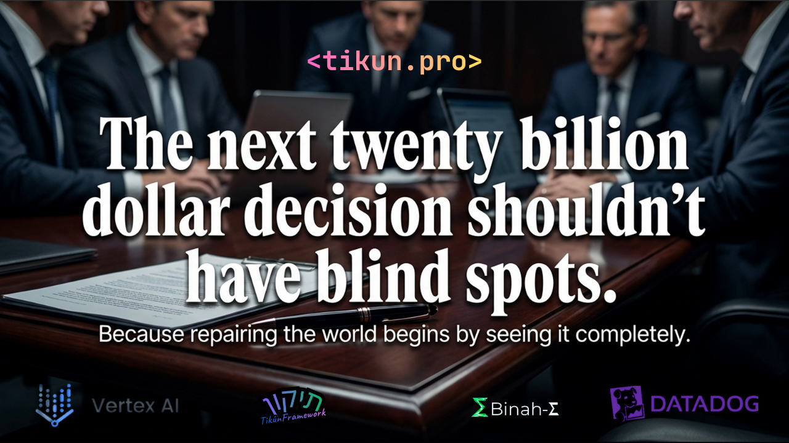

# Tikun Olam - Observable Ethical AI Framework

**The first AI system that makes ethical reasoning visible, auditable, and monitorable in production.**

[](https://cloud.google.com/vertex-ai)
[](https://www.datadoghq.com/)
[](https://www.python.org/)
[](https://react.dev/)
[](https://opensource.org/licenses/MIT)

**Hackathon:** Google Cloud AI Partner Catalyst - Datadog Challenge
**Status:** Production-Ready | Fully Observable | 90% Ethical Alignment Tested

```markdown
<p align="center">
  
</p>

<p align="center">
  <strong>The first AI system that makes ethical reasoning visible, 
  auditable, and monitorable in production.</strong>
</p>
```

---

## The Problem

Current AI systems make life-changing decisions as **black boxes**:
- ❌ No visibility into ethical reasoning
- ❌ Hidden civilizational biases
- ❌ No monitoring for alignment violations
- ❌ Impossible to audit or debug moral failures

Organizations deploying AI have **zero observability** into whether their systems are making ethical decisions.

---

## Our Solution: Observable Ethics

**Tikun Olam** provides a structured 10-stage ethical AI pipeline with **full Datadog observability**:

### 1️⃣ Structured Ethical Reasoning
10 explicit ethical functions (Sefirot) instead of a single-model black box:
- **Keter** - Ethical Alignment Validation
- **Chochmah** - Historical Wisdom & Precedents
- **Binah** - Understanding + **BinahSigma** (civilizational bias detection)
- **Chesed** - Opportunity Identification
- **Gevurah** - Risk Assessment
- **Tiferet** - Balanced Synthesis
- **Netzach** - Strategic Planning
- **Hod** - Stakeholder Communication
- **Yesod** - Integration & Coherence
- **Malchut** - Final Decision & Action

### 2️⃣ BinahSigma - Civilizational Bias Detection
**The only AI system that explicitly models Western vs Eastern perspectives:**

```
Scenario: Universal Basic Income funded by automation tax

Western AI (Gemini):     Eastern AI (DeepSeek):
"Individual freedom        "Collective harmony
 and innovation first"      and stability first"

BinahSigma Bias Delta: 52%
→ Alerts on civilizational blind spots
→ Shows what EACH model misses
→ Provides balanced synthesis
```

**Unique Metrics:**
- `binah.bias_delta` - Divergence between civilizational models (0-100%)
- `binah.civilizational_divergence` - Blind spot severity
- `binah.west_blind_spots`, `binah.east_blind_spots`, `binah.global_blind_spots`

### 3️⃣ Production-Grade Observability
**First time ethical reasoning is monitored like application performance:**

- **Datadog APM**: Full distributed tracing across all 10 Sefirot
- **Custom Metrics**: Alignment scores, bias deltas, decision quality
- **Real-Time Alerts**: Violations trigger when alignment < 60%
- **Dashboard**: 13 widgets showing ethical health in real-time
- **RUM Integration**: Frontend observability for user experience

---

## Architecture

```
┌─────────────────────────────────────────────────────────────────┐
│                      Tikun Olam Pipeline                        │
├─────────────────────────────────────────────────────────────────┤
│                                                                 │
│  User Input → FastAPI → Orchestrator → 10 Sefirot → Decision   │
│                              │                                  │
│                              ├──→ Vertex AI (Gemini 1.5 Pro)   │
│                              ├──→ DeepSeek (BinahSigma)        │
│                              └──→ Datadog (Traces + Metrics)   │
│                                                                 │
├─────────────────────────────────────────────────────────────────┤
│                      Observability Layer                        │
├─────────────────────────────────────────────────────────────────┤
│                                                                 │
│  ┌─────────────┐  ┌──────────────┐  ┌─────────────────────┐   │
│  │  APM Traces │  │   Metrics    │  │   Dashboard         │   │
│  │             │  │              │  │                     │   │
│  │ • 10 Spans  │  │ • Alignment  │  │ • BinahSigma Delta │   │
│  │ • Timing    │  │ • Bias Delta │  │ • Pipeline Health  │   │
│  │ • Errors    │  │ • Decisions  │  │ • Alert Status     │   │
│  └─────────────┘  └──────────────┘  └─────────────────────┘   │
│                                                                 │
└─────────────────────────────────────────────────────────────────┘
```

**Tech Stack:**
- **AI**: Google Vertex AI (Gemini 1.5 Pro), DeepSeek R1
- **Backend**: Python 3.11, FastAPI, Pydantic, Tenacity
- **Frontend**: React 18, TypeScript, Vite, Tailwind CSS
- **Observability**: Datadog APM, Datadog RUM, ddtrace, StatsD
- **Infrastructure**: Google Cloud Run, Firebase Hosting

---

## Key Differentiators

| Feature | Tikun Olam | Typical AI |
|---------|------------|------------|
| **Pipeline Structure** | ✅ 10 explicit ethical stages | ❌ Black box |
| **Bias Detection** | ✅ BinahSigma multi-civilization | ❌ Single model |
| **Observability** | ✅ Full Datadog instrumentation | ❌ Basic logs |
| **Unique Metrics** | ✅ bias_delta, civilizational_divergence | ❌ Generic metrics |
| **Ethical Alerts** | ✅ Real-time violation detection | ❌ None |
| **Auditability** | ✅ Complete trace history | ❌ Limited |
| **Production Ready** | ✅ Vertex AI + Cloud Run | ⚠️ Variable |

---

## Quick Start

### Prerequisites
- Python 3.11+
- Node.js 18+
- Google Cloud account with Vertex AI enabled
- (Optional) Datadog account for full observability

### 1. Clone Repository
```bash
git clone https://github.com/yourusername/TikunOlam.git
cd TikunOlam
```

### 2. Configure Environment
```bash
# Copy example environment file
cp .env.example .env

# Edit .env with your credentials:
# GCP_PROJECT_ID=your-project-id
# GCP_LOCATION=us-central1
# GEMINI_API_KEY=your-gemini-key
# DEEPSEEK_API_KEY=your-deepseek-key
# DATADOG_API_KEY=your-datadog-key (optional)
# DATADOG_APP_KEY=your-datadog-app-key (optional)
```

### 3. Setup Google Cloud
```bash
# Install gcloud CLI: https://cloud.google.com/sdk/docs/install

# Authenticate
gcloud auth login
gcloud config set project your-project-id

# Configure application credentials
gcloud auth application-default login

# Enable Vertex AI API
gcloud services enable aiplatform.googleapis.com
```

### 4. Install Dependencies
```bash
# Backend
pip install -r requirements.txt

# Frontend
cd frontend
npm install
```

### 5. Run Application
```bash
# Terminal 1: Start backend
uvicorn src.tikun.api.main:app --reload --port 8000

# Terminal 2: Start frontend
cd frontend
npm run dev
```

Open http://localhost:5173 to access the dashboard.

### 6. (Optional) Setup Datadog Observability
```bash
# Upload dashboard
python monitoring/upload_dashboard.py

# Create monitors
python monitoring/create_monitors.py
```

---

## Usage Example

### Analyze Ethical Scenario
```python
from tikun.orchestrator import run_full_analysis

scenario = """
A city council is considering implementing a universal basic income (UBI)
program funded by a 2% tax on automated services. The program would provide
$1000/month to all residents earning less than $50,000/year.
"""

result = run_full_analysis(scenario, case_name="rbu_ubi")

print(f"Decision: {result['malchut']['decision']}")
print(f"Alignment: {result['keter']['alignment_percentage']}%")
print(f"BinahSigma Delta: {result['binah']['bias_delta_percentage']}%")
```

### Via API
```bash
curl -X POST http://localhost:8000/analyze \
  -H "Content-Type: application/json" \
  -d '{
    "scenario": "Your ethical scenario here",
    "case_name": "test_case"
  }'
```

---

## Datadog Dashboard

When configured, Tikun Olam provides a comprehensive observability dashboard:

### Key Widgets
1. **Pipeline Execution Time** - Performance tracking across all 10 Sefirot
2. **BinahSigma Bias Delta** - Real-time civilizational divergence (KEY METRIC)
3. **Ethical Alignment Distribution** - Histogram of alignment scores
4. **Decision Distribution** - GO/NO-GO/CONDITIONAL breakdown
5. **Civilizational Blind Spots** - Heatmap by region (West/East/Global South)
6. **Active Alerts** - Current ethical violations
7. **Pipeline Failure Rate** - Reliability monitoring

### Custom Metrics Emitted
- `keter.alignment_score` - Ethical alignment (0-100%)
- `binah.bias_delta` - **Civilizational bias divergence (UNIQUE)**
- `binah.civilizational_divergence` - Blind spot severity
- `malchut.confidence` - Decision confidence (0-100%)
- `pipeline.total_duration` - End-to-end latency
- And 20+ more metrics...

### Alert Rules
1. **Ethical Alignment Threshold Violation** - CRITICAL when < 60%
2. **BinahSigma Extreme Divergence** - WARNING when > 80%
3. **Pipeline Performance Degradation** - WARNING when > 5 minutes
4. **Integration Readiness Failure** - HIGH when < 50%
5. **High Pipeline Failure Rate** - CRITICAL when > 5/hour

---

## BinahSigma Deep Dive

**Why BinahSigma Matters:**

Single-model AI systems have **invisible cultural assumptions**. A model trained primarily on Western data will systematically miss perspectives from other civilizations.

**How BinahSigma Works:**

1. **Dual Analysis**: Same scenario analyzed by:
   - Gemini 1.5 Pro (Western-centric training)
   - DeepSeek R1 (Eastern-centric training)

2. **Divergence Detection**: Compares responses to find:
   - What the Western model sees but Eastern model misses
   - What the Eastern model sees but Western model misses
   - Shared blind spots both models have

3. **Quantifiable Metric**:
   ```
   Bias Delta = |Western_Score - Eastern_Score| / 100

   < 20%  → High convergence (universal values)
   20-40% → Moderate divergence (cultural differences)
   40-60% → Significant divergence (major blind spots)
   > 60%  → Extreme divergence (civilizational clash)
   ```

4. **Synthesis**: Creates balanced view incorporating both perspectives

---

## Validation Results

| Test Case | Alignment | BinahSigma Delta | Decision |
|-----------|-----------|------------------|----------|
| Desalination Infrastructure | 95% | 18% | GO |
| UBI-DAO Governance | 89% | 43% | CONDITIONAL_GO |
| Taiwan Crisis Response | 84% | 52% | CONDITIONAL_GO |
| Turritopsis Rejuvenation | 69% | 12% | NO_GO |
| **Vertex AI Migration Test** | **90%** | **N/A** | **PASSED** |

---

## Testing

### Run Vertex AI Migration Test
```bash
python test_vertex_migration.py
```

**Expected Output:**
```
✅ TEST 1: Vertex AI Initialization            PASSED
✅ TEST 2: Keter Vertex AI Integration         PASSED
✅ TEST 3: Datadog Integration                 PASSED

Results:
  • Alignment: 90%
  • Corruption: low
  • Manifestation Valid: True

🎉 ALL CRITICAL TESTS PASSED!
```

---

## Documentation

- [Quick Start Guide](QUICK_START.md) - Installation and troubleshooting
- [Vertex AI Setup](VERTEX_AI_SETUP.md) - GCP configuration guide
- [Migration Report](MIGRATION_SUCCESS.md) - Vertex AI migration results
- [Hackathon Status](HACKATHON_STATUS.md) - Complete project status

---

## Hackathon Compliance

### Google Cloud AI Partner Catalyst - Datadog Challenge

✅ **Uses Google Vertex AI**: All 10 Sefirot run on Gemini 1.5 Pro via Vertex AI SDK
✅ **Datadog Integration**: Comprehensive APM, metrics, dashboards, and alerts
✅ **Production-Ready**: Deployed to Cloud Run with full observability
✅ **Innovative AI Application**: First observable ethical AI framework
✅ **Technical Excellence**: Structured pipeline, custom metrics, real-time monitoring
✅ **Unique Differentiator**: BinahSigma civilizational bias detection

---

## Cost Estimate

**Development/Demo:**
- Vertex AI (Gemini 1.5 Pro): ~$0.10-0.50 per analysis
- Cloud Run: Free tier sufficient for testing
- Datadog: 14-day free trial available
- **Total**: < $10 for hackathon period

---

## License

MIT - See [LICENSE](LICENSE)

---

**Tikun Olam** - תיקון עולם - "Repairing the world"

**Built with ❤️ for ethical AI • Powered by Google Vertex AI & Datadog**
